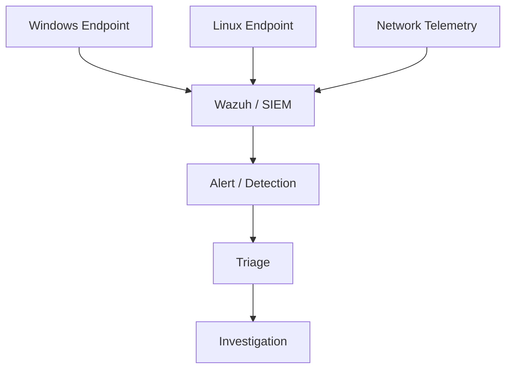

# Security Monitoring & Threat Detection Lab

Hands-on cybersecurity case study focused on endpoint visibility, SIEM fundamentals, network context, and repeatable investigation reasoning.

**Portfolio:** https://devanshujamwal.github.io/Devanshujamwal/projects/security-monitoring/

## Overview

This repository documents a learning environment built around Windows/Linux event visibility, Wazuh and SIEM concepts, network telemetry, and basic security-event investigation.

The goal is not to present simulated alerts as professional SOC incidents. Instead, the project shows how endpoint events, network evidence, and security context can be reviewed methodically before deciding what an alert means.

## Objective

Understand how telemetry moves from systems and networks into a centralized monitoring workflow, and how an analyst can validate an event before treating it as a confirmed incident.

## Architecture

## Technologies

- Wazuh
- SIEM fundamentals
- Windows
- Linux
- Wireshark
- Palo Alto Networks concepts
- Firewall policy concepts
- MITRE ATT&CK concepts
- Endpoint monitoring

## Implementation

### Endpoint visibility
Worked with Windows and Linux security-event concepts to understand what useful endpoint telemetry looks like and how it can support investigation.

### SIEM workflow
Used Wazuh/SIEM concepts to understand centralized event collection, alert review, and the importance of source context.

### Network context
Used Wireshark and firewall/security coursework concepts to relate endpoint activity to network behaviour, traffic inspection, and policy enforcement.

### Investigation reasoning
Focused on timestamps, source systems, event context, and related activity before drawing conclusions from an individual alert.

## Troubleshooting approach

When expected telemetry is missing or an alert looks unusual:

1. Confirm the endpoint or data source is healthy.
2. Check agent/source connectivity.
3. Validate system time and timestamps.
4. Confirm the collection/ingestion path.
5. Correlate the event with endpoint and network context.
6. Review relevant firewall or security-policy behaviour.
7. Document what is verified separately from what is inferred.

## Validation

This repository describes cybersecurity lab work and investigation methodology. It does **not** claim professional SOC experience, real customer incidents, or fabricated detection outcomes.

## What I learned

An alert is a starting point, not a conclusion. Reliable investigation depends on telemetry quality, context, network evidence, and a repeatable process for distinguishing facts from assumptions.

## Related skills

Security monitoring · Windows/Linux · Networking · Wireshark · Firewall concepts · Troubleshooting · Documentation

## Portfolio

See the complete portfolio and my other technical case studies:

**https://devanshujamwal.github.io/Devanshujamwal/**

---
**Devanshu Jamwal** · IT Support · Systems · Networking · Cloud
