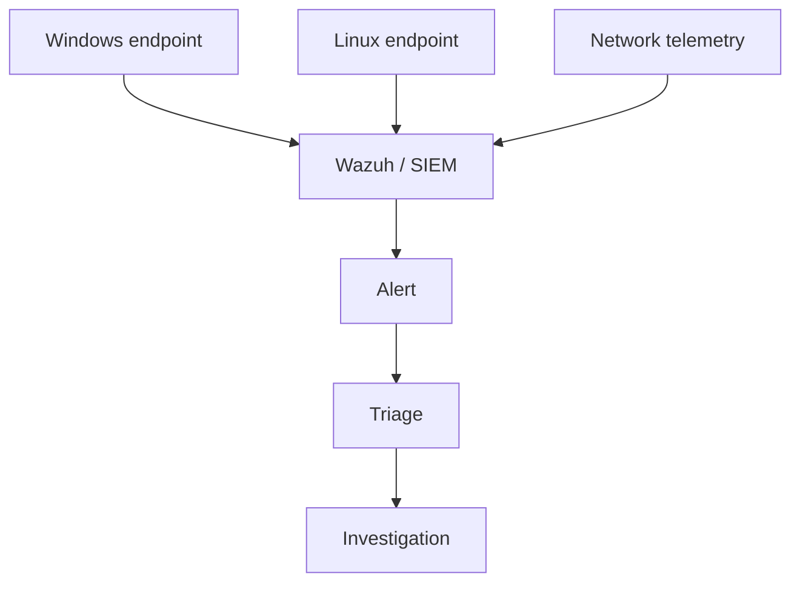

# Security Monitoring & Threat Detection Lab

A hands-on cybersecurity case study focused on **endpoint visibility, SIEM fundamentals, network context, and disciplined alert investigation**.

**Portfolio case study:** https://devanshujamwal.github.io/Devanshujamwal/projects/security-monitoring/

## At a glance

| Area | Details |
|---|---|
| Endpoints | Windows and Linux |
| Monitoring | Wazuh / SIEM fundamentals |
| Network context | Wireshark |
| Security concepts | Palo Alto, firewall policy, MITRE ATT&CK concepts |
| Focus | Triage, evidence validation, investigation reasoning |

## Monitoring flow

## What I worked on

- Windows/Linux event and endpoint-monitoring concepts.
- Wazuh/SIEM fundamentals for centralized review.
- Wireshark for network context.
- Firewall and policy concepts from Palo Alto coursework.
- Reviewing timestamps, source systems, and related activity before drawing conclusions.

## Triage approach

1. Identify the alert and affected host/source.
2. Confirm the telemetry source is healthy.
3. Validate timestamps and collection path.
4. Review endpoint context.
5. Correlate network activity where available.
6. Separate observed facts from assumptions.
7. Document the conclusion and remaining uncertainty.

## Skills demonstrated

**Security:** SIEM concepts, Wazuh, endpoint monitoring, alert triage  
**Networking:** Wireshark, traffic context, firewall concepts  
**Systems:** Windows, Linux  
**Operational skills:** Evidence validation, documentation, structured investigation

## Documentation

- [Monitoring architecture notes](./docs/architecture.md)
- [Security event triage playbook](./docs/triage-playbook.md)

## Scope

This is cybersecurity lab work, not professional SOC experience. The repository intentionally avoids fabricated alerts, customer incidents, and unsupported detection metrics.

## What I learned

An alert is a starting point, not a conclusion. Useful investigation depends on telemetry quality, endpoint context, network evidence, and a repeatable process.

## Next improvements

A future lab refresh could include sanitized sample events, agent-health checks, and a small set of reproducible detections generated in a controlled environment.

---
**Devanshu Jamwal** · IT Support · Systems · Networking · Cloud  
[Portfolio](https://devanshujamwal.github.io/Devanshujamwal/) · [GitHub Profile](https://github.com/Devanshujamwal)
